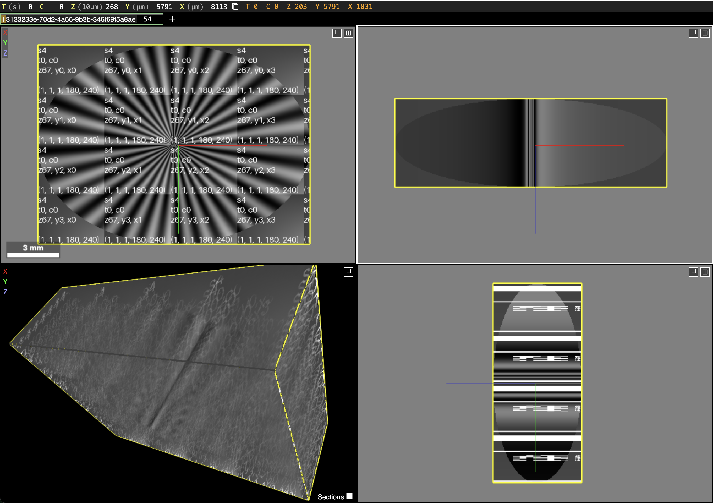
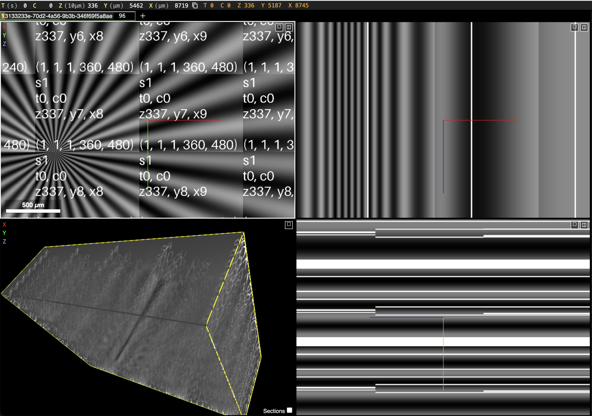

# zarr-testcard

The goal of this project is to create a test card for the Zarr format. The test card is a
procedurally generated dataset that can be used to test a Zarr implementations, particularly
viewers, without requiring a large amount of actual storage or memory.

The main test pattern is a 5D dataset with `T`, `C`, `Z`, `Y`, and `X` dimensions. The generator can
generate this image with arbitrary sizes and chunks for each dimension. The image contains the
following features, intended to reveal the underlying structure of the Zarr format:

* a linear gradient in each `XYZ` chunk, with the gradient direction changing along the `C`
  dimension
* a radial sine pattern in the `XY` plane, with an ellipsoid envelope in `XYZ`
* the radial sine pattern rotates with the `T` dimension
* chunk indices and sizes are written in the image in the `XY` plane:
    * s{scale}
    * t{time chunk index}, c{channel chunk index}
    * z{z chunk index}, y{y chunk index}, x{x chunk index}
    * ({chunk size})

Below a multiscale version of the test is shown in Neuroglancer at two zoom levels.

The test card is generated using a Zarr `ComputeStore`. Additional generated datasets may be
added by implementing the `ChunkGenerator` protocol, which is used by the `ComputeStore`
class.

## server

This library also includes a simple server for serving the test card over HTTP. This makes it
suitable for testing web-baed Zarr viewers such as Vizarr and Neuroglancer.

The server additional includes a "create" endpoint that allows the user to create a new test card
with custom size and chunking. This makes it possible to run a test card service.
